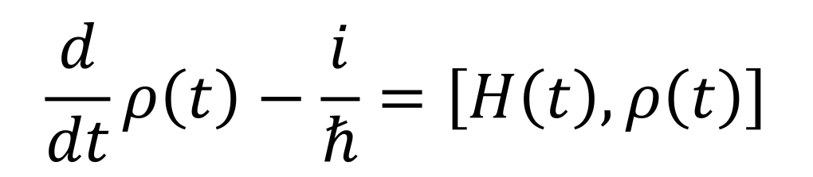
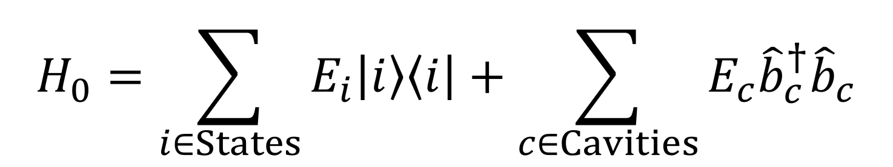
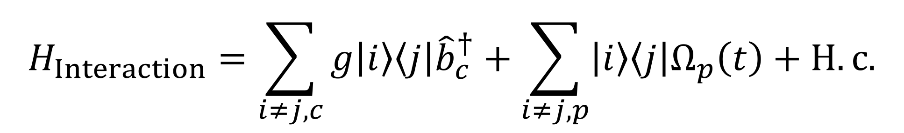
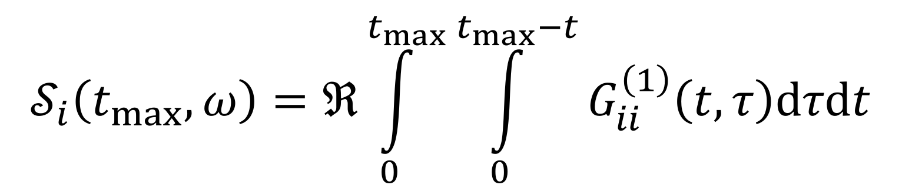
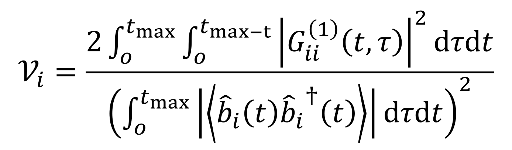
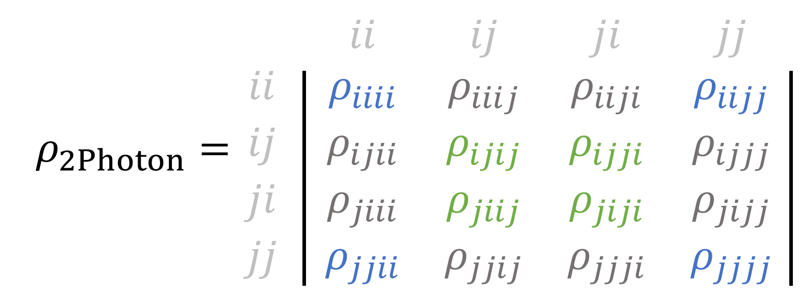

# QDaCC - Quantum Dot and Cavity Computing

I created this program throughout my Bachelor's, Master's and my time as an ongoing PHD Student at the University of Paderborn.

 

Published Work using QDaCC:

["Ultrafast electric control of cavity mediated single-photon and photon-pair generation with semiconductor quantum dots"](https://journals.aps.org/prb/abstract/10.1103/PhysRevB.104.085308)

   

["On-demand indistinguishable and entangled photons at telecom frequencies using tailored cavity designs"](https://onlinelibrary.wiley.com/doi/10.1002/qute.202300142)

   

["Time-bin entanglement in the deterministic generation of linear photonic cluster states"](https://arxiv.org/abs/2403.08527)

  

There is a GUI available at [gitub/QDaCC-GUI](https://github.com/davidbauch/QDaCC-Tools/)

# Building QDaCC
QDaCC is build using a simple makefile.

Build using `Dense` matrices

    make clean
    make -j10 UFLAG="-DLOG_DISABLE_L3 VERSION=dense"

Build using `Sparse` matrices

    make clean
    make -j10 UFLAG="-DLOG_DISABLE_L3 VERSION=sparse -DUSE_SPARSE_MATRIX"

Note: The `LOG_DISABLE_L3` flag is subject to change and will most likely be the default value in the code. L3 log will then require to be enabled instead of disabled.

# What does it do?

This program solves the von-Neumann Equation

for a given fermionic (electronic) system coupled to a (or multiple) bosonic optical resonator including multiple sources of Loss and Electron-Phonon coupling.

The Hamilton Operator for the electronic and optical states reads

and is treated by an Interaction picture Transformation.
The Interaction Hamilton is given by

where the transitions `|i><j|` are either coupled to the optical resonator `c` and/or to an external driving field `p`.

# Features

The general features of this program include:

- Time integration using either the Runge-Kutta method of order 4 or 5, or an adaptive stepsize Runge-Kutta Dormand–Prince method
- Electron-Phonon coupling using the Polaron Frame approximation
  - Double Markov for lower numerical effort
  - Single Markov for greater numerical completness
  - Numerically exact calculating of the Polaron Transformation using a Time-Retarded Integral
- Electron-Phonon coupling using the Path Integral approach
  - Numerically exact
- Correlation functions G1 and G2, Single and Double time integrated
- Emission Spectra of any electronic or optical transition (mutliple transitions with "+")
- Indistinguishability of any electronic or optical transition
- Concurrence of any two electronic or optical transitions
- Wigner function of any single electronic or optical transition
- Detector Temporal and Spectral envelopes

# Usage

All numerical parameters support the following units:
Units of Energy:

- `Hz` - Hertz, may be omitted, meaning the default unit for energy is `Hz`
- `eV` - Electron Volt
- `meV` - Milli Electron Volt `= 1E-3eV`
- `mueV` - Micro Electron Volt `= 1E-6eV`

Units of Time:

- `s` - Seconds, may be omitted, meaning the default value for time is `s`
- `ns` - Nanoseconds `= 1E-9s`
- `ps` - Picoseconds `= 1E-12s`
- `fs` - Femtoseconds `= 1E-15s`

Misc Units:

- `pi` - Used to calculate the area of pulses.

---

## Inputting Parameters

    --file [FILEPATH]

The program can read multiple parameter subsets from a given file. The first line of this file should start with a `#`, followed by the name of the project, which is also the subfolder that will be created for the project. Every other `#` indicates a comment, which can start at any point of the line.

Example:

    # NameOfTheProject
    [Parameterset2] # Comment
    # Random Comment
    [Parameterset2] # Comment

---

## System Parameters

The program accepts two types of systems which will be transformed into a total system by using the tensor product of the single bases. A single electronic system can be tensored with multiple optical systems, where every electronic transition can be coupled to any optical system.

### Electronic Sytem - Fermionic States

The general syntax for a system with a single electronic state reads:

    --SE [...;Name:Energy:CoupledTo:DecayScaling:DephasingScaling:PhononCoupling;...]

Multiple electronic states can be chained by using the chain operator `;`. The parameters for a state read as follows:

- `Name` : **Single Uppercase** Character Identifier. **Must** be unique amoung all electronic states.
- `Energy` : Energy of the state. Supports the Units of Energy.
- `CoupledTo` : Comma seperated Single Character Indentifier of any other state that this state is coupled to. Using `-` indicates the state is not coupled to anything.
- `DecayScaling` : Scaling factor (float) for the radiative decay rate for this state
- `DephasingScaling` : Scaling factor (float) for the dephasing rate for this state
- `PhononCoupling` : Scaling factor (float) for the electron-phonon coupling

Example:

    --SE 'G:0:X:0:1:0;X:1.5eV:-:1:1:1'

- Ground State `Name = G` with `Energy = 0`. The groundstate cannot decay radiatively, such that `DecayScaling = 0`. Because the phase relation of this and other states can decay, `DephasingScaling = 1`. This state should not be influenced by phonons with `PhononCoupling = 0`.
- Excited State `Name = X` with `Energy = 1.5eV`. The excited state can decay radiatively, with `DecayScaling = 1`. Because the phase relation of this and other states can decay, `DephasingScaling = 1`. This state is affected by electron-phonon coupling, hence `PhononCoupling = 1`.

### Photonic System - Bosonic Cavity Resonator

The general syntax for a system with a single optical resonator reads:

    --SO [...;Name:Energy:MaxPhotons:CoupledToTransition:CouplingScaling:DecayScaling;...]

Multiple photonic states can be chained by using the chain operator `;`. The parameters for a state read as follows:

- `Name` : **Single Lowercase** Character Identifier. **Must** be unique amoung all resonators.
- `Energy` : Energy of the resonator. Supports the Units of Energy.
- `MaxPhotons` : Maximum Photon Number for this resonator.
- `CoupledToTransition` : Comma seperated Electronic Transitions this resonator is coupled to. Uses the _upwards_ transition of two states. The transition has to exist in the electronic system.
- `CouplingScaling` : Scaling factor (float) for the transitions. When multiple transitions are provided, an qual number of scaling factors, seperated by commas, have to be defined.
- `DecayScaling` : Scaling factor (float) for the decay rate of photon population inside the resonator.

Example:

    --SE 'c:1.5eV:2:G=X:1:1'

- Cavity with `Name = c` with `Energy = 1.5eV`. The maximum number of photons allowed is `MaxPhotons = 2`. The resonator is coupled to the electronic transition `CoupledToTransition = G=X` with a coupling scaling of `CouplingScaling = 1`. The photons inside the resonator decay with a scaled rate of `DecayScaling = 1`.

### Further Examples

- Single Exciton with no Cavity. Hilbert Space Dimensions: `2 by 2`.
  `--SE 'G:0:X:0:1:0;X:1.5eV:-:1:1:1'`
- Single Exciton coupled to a single mode Resonator with a maximum of two photons. Hilbert Space Dimensions: 6 by 6
  `--SE 'G:0:X:0:1:0;X:1.5eV:-:1:1:1'`
  `--SO 'c:1.5eV:2:G=X:1:1'`
- Three Level System with cavity at two-photon resonance. No direct Ground-to-HiG=Hest State transition is allowed in this system. Phonons scaled doubled for the upper state. Hilbert Space Dimensions: `9 by 9`.
  `--SE 'G:0:L:0:1:0;L:1.5eV:U:1:1:1;U:2.8eV:-:1:1:2'`
  `--SO 'c:1.6eV:2:GL,LU:1,1:1'`
- [Polarized Biexciton with polarization dependent cavity modes](https://journals.aps.org/prb/abstract/10.1103/PhysRevB.104.085308). The excitons are seperated by a large finestructuresplitting energy of `100mueV` and the biexciton is reduced by a binding energy of `20meV`. The resonators lie at the two-photon resonance of the biexciton and only couple to their specific polarized exciton transitions. Hilbert Space Dimensions: `36 by 36`.
  `--SE 'G:0:H,V:0:1:0;H:1.5001eV:Z:1:1:1;V:1.4999eV:Z:1:1:1;Z:2.98eV:-:1:1:1'`
  `--SO 'h:1.49eV:2:G=H,H=Z:1,1:1;v:1.49eV:2:G=V,V=Z:1,1:1'`
- Polarized Biexciton with polarization dependend bi-modal cavity modes. The two energetically distinguishable resonator modes enhance the ground-exciton as well as the exciton-biexciton transitions. Hilbert Space Dimensions: `324 by 324`.
  `--SE 'G:0:H,V:0:1:0;H:1.5001eV:Z:1:1:1;V:1.4999eV:Z:1:1:1;Z:2.98eV:-:1:1:1'`
  `--SO 'h:1.5eV:2:G=H,H=Z:1,1:1;v:1.5eV:2:G=V,V=Z:1,1:1;k:1.48eV:2:G=H,H=Z:1,1:1;l:1.48eV:2:G=V,V=Z:1,1:1'`

### Optical Pulse - Optical Driving of the electronic or optical transitions

The electronic states as well as the resonator modes can be driven by an optical pulse. The general syntax reads:

    --SP '[...;Name:CoupledToTransition:Amp:Freq:Width:Center:Type(s);...]'

Multiple transitions can be driven by multiple pulses, and multiple pulses can be chained by using the chain operator `;`. The parameters read as follows:

- `Name` : **Single Lowercase** Character Identifier. **Must** be unique amoung all pulses.
- `CoupledToTransition` : Comma seperated list of electronic transitions or optical resonators this set of pulses is coupled to.
- `Amp` : Amplitude of the pulse. When defined as a Gaussian pulse (see `Type`), this amplitude is assumed to be the pulse area in units of PI. In any other case, this value supports the Units of Energy.
- `Freq` : Frequency of the pulse using `e^(-i*omega)` where omega is the pulse frequency. This parameter supports the Units of Energy.
- `Width` : Temporal pulse width. This parameter supports the Units of Time.
- `Center` : Temporal center of the pulse. This parameter supports the Units of Time.
- `Type` : Type of the pulse, can either be a superposition of either `gauss` or `cw` (continuous wave) and `chirped(rate)`,`super(amp_freq)`,`exponent(exp)` and `cutoff(delta)`. The latter can be combined using the `+` operator.

Multiple pulses can be applied onto the same transitions by using comma sperated values for `Amp`,`Freq`,`Width`,`Center` and `Type`. In the case of `Type = cw`, the parameter `Width` does nothing.

There are additional type parameters that can be added onto either `cw` or `gauss` using the `+` operator. The additional settings include:

- `chirped(rate)` : [Pulse Chirp](https://journals.aps.org/prl/abstract/10.1103/PhysRevLett.106.166801) rate provided in brackets. This parameter supports the Units of Energy. The default value is zero. This parameter is not of any unit.
- `exponent(exp)` : Amplitude of the gaussian function `e^[(t-t0)^A]` provided in brackets, where `A = exp`. The default value is `exp = 2`. The parameter is not of any unit.
- `super(amp_freq)` : Parameters for the [FM-SUPER](https://journals.aps.org/prxquantum/abstract/10.1103/PRXQuantum.2.040354) excitation scheme provided in brackets. This settings requires two parameters seperated by `_`. The default value for both parameters is zero. The unit of both parameters is energy.
- `cutoff(delta)` : The pulse may be split into a [dichromatic pulse](https://www.nature.com/articles/s41567-019-0585-6.pdf) using `delta` as a seperator. The unit of this parameter is energy.

Examples:

    --SP 'p:G=X:1pi:1.5eV:2ps:20ps:gauss'

Pulse for a single exciton with `Amp = PulseArea = 1*PI`, `Energy = 1.5eV`, centered at `Center = 20ps` with width `Width = 2ps`. The pulse is not chirped such that `Chirp = 0`. A Gaussian shape is used. Not that with `Type = gauss`, this pulse would have an energy equivalent of `Energy = 1H=Z` due to the missing specification for the type. Since no `GaussAmp` was provided, the default value of `2` is used.

    --SP 'p:G=H,H=Z:5.4pi:1.48eV:5ps:30ps:gauss+exponent(12)'

Pulse for the horizontally polarized biexciton transition. A `GaussAmp = 12` is used to approximate a flat-top Gaussian shape.

    --SP 'p:G=H,H=Z:5.4pi,1pi,1:1.48eV,1.5eV,1.5eV:5ps,1ps,1ps:30ps,50ps,60ps:gauss,gauss,gauss'

The same pulse as before, followed by two short PI-pulses at later times.

    --SP 'p:GL:1pi:1.5eV:2ps:20ps:0:gauss;q:LU:1:1.4eV:2ps:24ps:gauss'

Two pulses for different electronic transitions for the three level system.

    --SP 'p:h:0.15meV:1.5eV:0:69fs:cw'

A continuous wave pulse with an amplitude of `Amp = 0.15meV`, frequency `Freq = 1.5eV` driving the resonator `h`. Make sure `h` actually exists as a resonator, or the program will crash. The `Center = 69fs` equals a phase shift relative to zero.

### Electronic Chirp - Temporal Detuning of the electronic states

The energy of the electronic states can be shifted over time by the electronic chirp. The general syntax reads:

    --SC [...;Name:CoupledTo:AmpFactors:Amps:Times:DDTs:Type;...]

Multiple levels can be changed by the same chirp, and multiple chirps can be chained using the chain operator `;`. The parameters read as follows:

- `Name` : **Single Lowercase** Character indentifier. **Must** be unique amoung all chirps.
- `CoupledTo` : Comma seperated list of uppercase electronic state identifiers this chirp should influence.
- `AmpFactors` : Comma seperated list of scaling factors for the identifiers listet prior.
- `Amps` : Comma seperated list of amplitudes.
- `Times` : Comma seperated list of times.
- `DDTs` : Comma sperated list of derivatives. This list of parameters is only used if `hermite` is chosen as the chirp generation method. If not used, this parameter can be omitted.
- `Type` : Type of chirp, can be one of the following: `linear`, `spline`, `monotone` and `hermite`, which is the interpolation method the chirp class uses to generate curves from the initial points specified.

Examples:

    --SC 'c:X:1:0,1meV,0,0:50ps,100ps,150ps,200ps:monotone'

A chirp for a single state `CoupledTo = X` with an amplitude scaling of `AmpFactors = 1`. The curve will follow the list of points provided using a monotone interpolation method.

    --SC 'c:H,V,Z:1,1,2:0,1meV,0,0:50ps,100ps,150ps,200ps:monotone'

The same chirp but for the biexciton system. The two single excitons are shifted with factor `1`, while the biexciton shifts twice with factor `2` because of its energy definition.

---

## Initial State

An initial state can be constructed by superpositioning different states with real or complex amplitudes. Providing a special instructor for the state, an initially coherent, thermal or squeezed state can be constructed too.

The general syntax reads:

    --R [INITIALSTATE]

where `INITIALSTATE` can be multiple of the following, chained by using the chain oprator `+`:

- `AMP|el|nN|...>`: General state, where `el` is the initially occupied electronic state. The amplitude for this state is `AMP`, where a complex amplitude is indicated by a trailing `i`. The initial resonator states `nN` are given by providing the resonator `N` and the photon number `n`. Note that the states are sorted alphabetically and need to be provided in the correct order for the initial state to function properly.
  - Replacing the photon number `n` by `coherent(alpha)` indicates the resonator `N` should be initialized into a coherent state with `<n>=alpha`
  - Replacing the photon number `n` by `thermal(alpha)` indicates the resonator `N` should be initialized into a thermal state with `<n>=alpha`
  - Replacing the photon number `n` by `squeezed(r,Phi)` indicates the resonator `N` should be initialized into a squeezed state with squeezing parameters `r` and `Phi`

Examples:

    --R ':B:0h:0v;'

Initial state is a fully occupied Biexciton with no phonons in either resonator.

    --R ':0.5:X;-0.5i:G;'

Initial state is a superposition of the Exciton and Groundstate. The result will be a pure state.

    --R :G:coherent(2)h;

Initial state is the electronic groundstate with a coherent state in resonator h with `alpha = 2`.

    --R :G:squeezed(0.1,0.5)h;

Initial state is the electronic groundstate with a squeezed state in resonator h with `r = 0.1` and `Phi = 0.5`.

---

## Environmental Parameters

The electronic and optical state configurations only include scaling paramters for coupling and decay rates. The actual rates are given by a seperate set of parameters to reduce the overall size of the input. Four different parameters have to be provided:

- `G`: Electron-Resonator Coupling; proportional to the spacial overlap of the electronic dipole and the resonator mode
- `KAPPA`: Photon Decay Rate; proportional to the degree of loss from any sources for the optical modes
- `RAD`: Radiative Decay Rate for the electronic states; proportional to the degree of coupling of the electronic states to the environment resulting in the emission of photons into non-Resonator modes
- `PURE`: Electronic Pure Dephasing; proportional to the degree of phenomenological electron-phonon coupling.

These parameters can be provided by

    --system [G] [KAPPA] [RAD] [PURE]

where all parameters support the units of energy. The default value for any of these parameters is zero.

If only a single parameters is to be changed, the following paramters can be used:

    --coupling [G]
    --kappa [KAPPA]
    --gamma [RAD]
    --gammapure [PURE]

Example:

    --system 50mueV 100mueV 0 1mueV

Providing a coupling of `G = 50mueV` with a cavity loss rate of `KAPPA = 100mueV`. The radiative decay `RAD` is zero and the electronic pure dephasing `PURE = 1mueV`.

---

## Temporal Settings

The program calculates the temporal dynamics of the provided system in a single given interval using either the fixed-stepsize RK4/RK5 or the variable order RK45 method. The timer interval is given by

    --time [START] [END] [STEP]

and supports the Units of Time. If `END` is set to `-1`, the temporal dynamics are calculated until the density matrix ground state is reached by at least `99.9%`. The density matrix diagonal index for the ground state can be provided by

    --groundstate [DM_INDEX]

where the default value for `DM_INDEX` is `0`. The ground state index can be passed using the same syntax as for the initial state.

If only a single parameter is to be changed, the following parameters can be used:

    --tstart [START]
    --tend [END]
    --tstep [STEP]

Examples:

    --time 0 2ns 100fs

Calculate from `0` to `2ns` using a timestep of `100fs`.

    --tstep 200fs

Use a timestep of `200fs`. If no `--tend [END]` is provided, the calculation will continue until the system is converged in its ground state. **Caution**: If the groundstate can never be reached, the program will fail to terminate.

---

## Electron-Phonon Coupling

The electron-phonon coupling can be calculated using two different approaches; The [Polaron approach](https://journals.aps.org/prb/supplemental/10.1103/PhysRevB.96.201201) utilizing at least one Markov approximation, where preferably two are used to significantly reduce calculation times; And the more suffisticated [Path-Integral Formalism](https://journals.aps.org/prb/supplemental/10.1103/PhysRevB.96.201201), where no such approximations need to be done.

### General Syntax for Phonons

In general, phonon contributions are not included unless a temperature is provided:

    --temperature [TEMP]

Where `TEMP` is any value greater than or equal to zero. For values smaller than zero, the electron-phonon coupling will be disabled.

The spectral properties of the phonons are defined by

.

While the specific spectral shape varies slightly for electrons (`e`) and holes (`h`), the algorithm used in this program assumes a unified distribution combining both electron and hole parameters into two settings:

    --phononalpha [COUPLING]

The effective phononcoupling. The default value for GaAs QDs lies around `COUPLING = 0.03ps^-2`.

    --phononwcutoff [CUTOFF]

The energy for which maximum coupling occurs. The default value for GaAs QDs lies around `CUTOFF = 1meV`

This correlation function tends to zero after only a few picoseconds. Hence, the integration will stop after a specified cutoff time:

    --phonontcutoff [TIMECUTOFF]

The default value for the default parameters specified above is set to `TIMECUTOFF = -1`, resulting in the cutoff time being automatically determined.

The Markov Approximation (`rho(t)=rho(t+tau)`) used by the Polaron Approach can be disabled by providing the flag

    -noMarkov

When a temperature greater or qual than zero is provided, the Radiative Decay and Pure Dephasing are scaled by the temperature to  and
.
Note that while the Radiative Decay only gets scaled by the averaged Phonon Contributions `<B>`, the Pure Dephasing becomes a per-Kelvin unit. This scaling can be disabled entirely by providing the flag

    -noPhononAdjust

### Phonon Order

Specifying the phonon order determins the method of evaluation for the time dependent Polaron Transformation or switches the method alltogether to use the Path Integral instead. The order of evaluation is set by

    --phononorder [ORDER]

where `ORDER` is an integer value between `0` and `5`. The order defines:

- `0`: Calculates the Time Transformation by integrating backwards in time. Numerically most complete, but also most expensive method.
- `1`: Calculates the Time Transformation by using a numerical matrix exponential. Decent approximation for small detunings.
- `2`: Neglects the Time Transformation. Numerically most incomplete and hence fastest approach. Becomes exact when the photon number is small and the pulse amplitude is near zero.
- `3`: Calculates the Phonon Contribution as and additional Lindblad term using an additional Markov Approximation ([compare](https://journals.aps.org/prx/abstract/10.1103/PhysRevX.1.021009)).
- `4`: Hybrid method between `0` and `2`, where for times with no pulse and small photon numbers, the fast method is used while the backwards integral is only utilized otherwise. Decent approach for reducing calculation times while remaining numerically more precise.
- `5`: Switch numerical evaluation method to the Path Integral Approach.

### Path Integral

The Path Integral approach accumulates all possible trajectories provided by the riG=Ht side of the von-Neumann equation weiG=Hted accordingly by the electron-phonon coupling throuG=H a fixed number of iteration steps.
The path integral specific settings read:

    --NC [STEPS]

The number of steps for the Path Integral to accumulate from. Larger values will significantly increase the numerical effort. The default value is `STEPS = 4` which corresponds to a Timestep of `1ps`.

    --tstepPath [STEP]

The stepsize for the Path Integral. The default value is `STEP = -1`, resulting in automatic determination of the timestep and using the iteratorStepsize.

    --iteratorStepsize [STEP]

The stepsize of the iterator, which is equivalent to the usual timestep for a RK4 calculation. The default value is `STEP = 100fs`.

There are additional numerical parameters that should not be changed and thus are not listed here. See [the settings file](.settings.cla) for details.

## Correlation functions

Two different types of correlation functions can be evaluated: `G1(t,tau)` and `G2(t,tau)`. From these two, quantum properties such as the `indistinguishability` or the `two-photon concurrence` can be evaluated. If the evaluation of any property that needs either G1 or G2 is provided, the correlation functions are calculated automatically. In this case, explicitely specifying to calculate the corresponding G1 or G2 functions is not neccessary. If the output of the corresponding function is needed, specification becomes neccessary again.

The G1 function is calculated via

.

The G2 function is calculated via

.

The general Syntax for both functions reads:

    --GF [Modes:Orders:Integration]

The parameters read as follows:

- `Modes` : Comma sperated list of modes to calculate the function for. Miltiple transitions can be combined via the `+` operator.
- `Orders` : Comma sperated list of the order corresponding to the specified mode.
- `Integration` : `0` for the `G(t,tau)` function, `1` for both the `t` and `tau` integrated functions and `2` for both. Note that the `G(t,tau)` output will be a possibly giant matrix resulting in filesizes of several hundreds of megabytes.

To specify the resolution for the `G1` and `G2` grid, see `Numerical Parameters` -> `Grid Resolution`

Examples:

    --GF 'h,G=X:1,1:2,2'

Calculating the G1 functions for the resonator mode `h` and the radiative electronic mode `G=X`. Both of order `1` and both output as a matrix and integrated.

    --GF 'h,h:1,2:2:2'

Calculating the G1 and G2 functions for the resonator mode `h`.

---

## Emission Spectrum

The emission characteristics of any transition can be calculated by using the [Eberly-Wodkiewicz](https://www.osapublishing.org/josa/abstract.cfm?uri=josa-67-9-1252) Spectrum and is calculated via

.

If the neccessary `G1` function is not yet available, it will be calculated automatically. The fourier transformation is brute-forced for a set number of points. The general syntax for spectrum calculation reads:

    --GS [Mode:Center:Resolution:Points]

The parameters read as follows:

- `Mode` : Comma sperated list of resonator modes or electronic transitions or any superposition of any of the available transitions. Multiple transitions can be added using the `+` operator.
- `Center` : Comma sperated list of spectral centers for the Fourier transformation of the corresponding mode. This parameter supports the Units of Energy.
- `Range` : Comma sperated list of spectral ranges for the Fourier transformation of the corresponding mode. This paramter suppports the Units of Energy.
- `Points` : Number of points the Fourier transformation should be avaluated on. The `dw` step of the integral is then determined by `dw=2w_Range/N_Points`.

Examples:

    --GS 'h:1.5eV:500mueV:1000'

Calculating the emission spectrum for the resonator mode `h` centered around `1.5meV` expanding for `500mueV` in both directions. The Fourier transformation is evaluated for `1000` points, resulting in $d\omega=1\mu eV$.

    --GS 'h,G=X,h+G=X:1.5eV,1.5eV,1.5eV:1meV,1meV,1meV:2000,2000,2000'

Calculating the emission spectra for the resonator mode `h`, the radiative transition `G=X` and the superposition of both `h+G=X` using the same parameters as before.

---

## Single Photon Indistinguishability and Visibility

The single photon [HOM indistinguishability](https://en.wikipedia.org/wiki/Hong%E2%80%93Ou%E2%80%93Mandel_effect) is a figure of merit for the consistentcy and quality of a single photon source. The indistinguishability is calculated [via](https://journals.aps.org/prb/abstract/10.1103/PhysRevB.98.045309)

with

and 

.

The single photon visibility is a more simple figure of merit for the photon quality and is calculated [via](https://journals.aps.org/prl/abstract/10.1103/PhysRevLett.125.233605)

.

If any of the neccessary `G1` or `G2` correlation functions is not yet available, it will be automatically calculated. The general syntax reads:

    --GI [Modes]

The parameters read as follows:

- `Modes` : Comma seperated list of modes to calculate both the indistinguishability as well as the visibility for. The superposition of multiple modes can be calculated using the `+` operator.

Since both properties require at least `G1(t,tau)`, they can always both be calculated without significantly increasing the required calculation times.

Examples:

    --GI 'h'

Calculate both properties for a single resonator mode `h`.

    --GI 'h,G=H,h+G=H'

Calculate both properties for the resonator mode `h`, the radiative transition `G=H` and the superposition of both.

---

## Two-Photon Concurrence - Measurement for the entanglement of two transitions

The [Two-Photon Concurrence](https://journals.aps.org/prl/abstract/10.1103/PhysRevLett.80.2245) is calculated by reducing the densitymatrix from its total Hilbert Space onto a two photon densitymatrix. The elements of this densitymatrix are calculated using the `G2` correlation function. A single element is calculated by integrating `G2_ijkl`, where `i`,`j`,`k` and `l` are one of the two modes that the concurrence is evaluated for.

The Two-Photon Matrix results in

with matrix elements

Because of symmetry of the operators, only 6 of the 8 `G2` functions have to be calculated. The concurrence is then evaluated by calculating the Eigenvalues of

where

If any of the neccessary `G2` correlation functions is not yet available, it will be automatically calculated. Note that if the Hilbert space of the system does not allow `G2` to be non-zero (e.g only a single photon allowed in a resonator mode), the concurrence will be undefined. The general syntax reads:

    --GC [Mode1-Mode2]

The parameters read as follows:

- `Mode1-Mode2` : Comma seperated list of modes. Two modes are connected using the `-` operator, indicating the Concurrence between those two modes is calculated. The superposition of multiple modes can be calculated using the `+` operator.

Examples:

    --GC 'h-v'

Calculating the concurrence for the two resonator modes of the polarization dependent biexciton.

    --GC 'h+G=H+H=Z-v+G=V+V=Z'

Calculating the concurrence for every cavity or radiative mode of the polarization dependent biexciton.

---

## Wigner Function

The Wigner function is calculated using the weiG=Hted superposition of Laguerre polynomials. A reduced denistymatrix for a given mode is calculated by using a partial trace over the total Hilbert space. This densitymatrix is then assumed to be in a Fock-base containing the different weiG=Hts for the Laguerre polynomials.

The general syntax to calculate the Wigner function reads:

    --GW [Modes,X(,Y,Resolution,Skip)]

The parameters read as follows:

- `Modes` : Comma seperated list of (resonator) modes to calculate the Wigner function for
- `X` : Comma sperated list of X-Resolutions, where the total interval will be `-X:X`
- `Y` : Optional Parameter, comma seperated list of Y-Resolutions. As default it is assumed that X=Y
- `Resolution` : Optional Parameter, comma sperated list of resolutions, where `dx,dy = 2X/Resolution, 2Y/Resolution`. The default value is `100`.
- `Skip` : Number of timesteps to skip. HiG=Her values will result in faster calculations. The default value is `1`.

Examples:

    --GW 'h:5'

Calculate the Wigner function using the parameterset `h:5:5:100:1`.

    --GW 'h:4:6:200:2'

Calculating the Wigner function using `-X:X = -4:4`, `-Y:Y = -6:6` with `200` Points for each axis, resulting in `dx = 0.04` and `dy = 0.06`. The Wigner function is only evaluated for every second timestep, even if those timesteps are not equidistant (e.g. for RK45 or a modified grid without interpolation).

Note that the Wigner function can also be used to calculate the reduced density matrices for any mode. Using one of the electronic states as the mode, one obtains the reduced electronic density matrix.

## Detector Envelopes

There are two possible envelope techniques for simulating a non-perfect detector to modify the `G_i` correlation functions. Note, that the usual temporal properties, e.g. the electronic and bosonic populations, are not affected by the detector properties. The general syntax for providing the detector settings reads

    --detector [temporal;spectral]

where either `temporal`, `spectral` or both can be `none`, indicating a perfect detection.

---

### Temporal Envelope

The detector temporal envelope may contain one or more detection windows, where the syntax for `temporal` reads:

    sigma:center:amp

where multiple parametersets can be chained via the `,` operator. The `center` parameter denotes the temporal center auf a Gaussian envelope with width `sigma` and a Gaussian power amplitude of `amp`. The `G_i` correlation functions will the be multiplied elemnt wise with the temporal detector matrix.

Examples:

    --detector 10ps:100ps:4;none

A temporal detector at `center = 100ps`, width `sigma = 10ps` and a Gaussian power of `amp = 4`.

    --detector 10ps,10ps:100ps,200ps:2,2

Two detectors at `center_1 = 100ps` and `center_2 = 200ps` with their corresponding width and amplitudes.

---

### Spectral Envelope

The detector spectral envelope may contain one or more detection windows, where the syntax for `spectral` reads:

    sigma:center:amp:points

where multiple parametersets can be chained via the `,` operator, analogous to the detector temporal properties. The `center` parameter denotes the spectral center of a Gaussian envelope with width `sigma` and a Gaussian power amplitude of `amp`. The `G_i` correlation functions will then be Fourier-transformed in `tau` direction only using `points` number of discrete points. The resulting Fourier-representation will then be multiplied with the detector envelope, and transformed back using the inverse Fourier-transformation.

Examples:

    --detector none;100mueV,100mueV:1.1eV,0.9eV:2,2:100,100

Two detectors at `center_1 = 1.1eV` and `center_2 = 0.9eV` with their corresponding parameters.

---

Both the temporal and the spectral features can be combined, for example:

    --detector 10ps:100ps:4;100mueV,100mueV:1.1eV,0.9eV:2,2:100,100

---

---

## Numerical Parameters

Different numerical Parameters

---

### Interaction Picture Transformation

To reduce calculation times, a transformation into the interaction picture and the corresponding Rotating Wave Approximation (RWA) is utilized.

Both can be disabled by providing the flag

    -noInteractionpic

to disable the interaction picture transformation and

    -noRWA

to disable the Rotating Wave Approximation.

The interaction picture transformation is carried out analytically within the program and is hence exact. Disabling it only increases to numerical effort.

---

### Grid Resolution

Defines the t-tau grid on wich the G1/G2 correlation functions are evaluated.

    --gridres [NUM]

Defines the Grid timestep `(t1-t0)/NUM` such that exactly `NUM` timesteps are evaluated. The standard value is `-1`, which indicates that all timesteps should be used.

    --grid [...;t:dt;...]

Defines the Grid via several intervals. The syntax for the intervals is defined as `t:dt`, where `t` is the upper limit for where the timestep `dt` should be used. Indicated by the `...`, multiple intervals can be chained via `;`. Note, that this option overwrites `--gridres`.

Examples:

    --gridres 500

Uses 500 timesteps for the correlation grid.

    --grid '10ps:100fs;30ps:200fs;60ps:300fs'

Uses `10ps/100fs + 20ps/200fs + 30ps/300fs = 300` points for the grid, where for the first 10ps a timestep of 100fs is used, between 10ps and 20ps a timestep of 200fs is used, and between 20ps and 30ps a timestep of 300fs is used.

NOTE: If no `grid` nor `gridres` is provided, the `gridres` value is determined automatically. The timestep provided via the `--time` flag will then directly determine the gridres. This may lead to very low resolution grids. In this case, the grid should be provided seperately with the `--grid` flag.

---

### Interpolation

The program uses interpolation for creating equidistant grids for the G1 and G2 calculations, as well as creating smooth outputs for the raw data that is calculated using varying timesteps. If not specified, the temporal outputs are not interpolated. The correlation functions are always at least linearly interpolated onto equidistant grids to guarantee all G1 and G2 functions are compatible with each other.

    -interpolate

Enables interpolation of the temporal output data. The standard interpolation method used is the [Monotone Hermite Spline Interpolation](https://jbrd.github.io/2020/12/27/monotone-cubic-interpolation.html) provided by the [ALGLIB](https://www.alglib.net/) package. If this flag ist not passed, the temporal outputs will **NOT** be interpolated.

    --interpolateOrder [orderTime,orderTau]

Defines the interpolation method for both the temporal output data as well as the data used by the G1 and G2 correlation functions. The standard method for interpolation for the correlation functions is a simple [Linear Interpolation](https://en.wikipedia.org/wiki/Linear_interpolation). Both parameters can either be `monotone` or `linear`. The correlation parameter can be omitted if only the temporal interpolation method should be changed.

Examples:

    --interpolateOrder 'monotone,monotone'

Changes the interpolation method for the correlation functions to use the Monotone Interpolation as well. Note that to change to interpolation method for the correlation function, the interpolation method for the temporal direction also has to be defined.

    --interpolateOrder linear

Changes the interpolation method for the temporal output data to use the Linear Interpolation.

Note that the interpolation is only usefull when using the `RK45` method. If one wants to use `RK4` or `RK5` but still interpolate the output to more or fewer timesteps, the `--grid` parameter can be used to achieve this:

    --rkorder 4 --tstep 10fs --tend 100ps --grid 1ps:100ps

Will result in the `RK4` method to use a `10fs` timestep, while the output will be output only for the grid parameters.

---

### Logfile Output

The program generates `logfile.log` which contains information about the input parameters as well as the calculated outputs. While general information is always logged, hiG=Her tiers of logging can be enabled, mostly for debugging purposes because the creator of this program refuses to read into actual g++ debugging :)

    -L2

This flag enables subroutine logging, meaning more information about the parameters passed into a function are output to the console and to the logfile.

    -L3

This flag enables deep logging, where all subroutines log everything they do. Soley for debugging.

    -handler

This flag enables handler outputs for the [Threadhandler](https://github.com/davidbauch/Threadhandler), an ancient project which is no longer continued.
